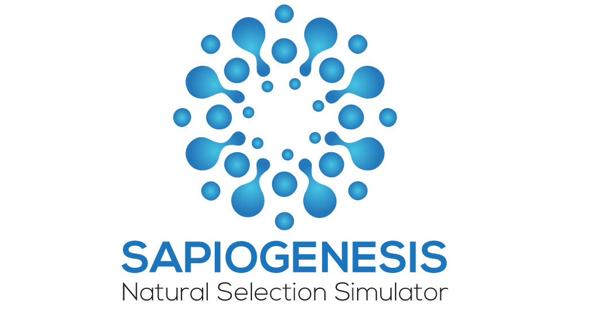

# Sapiogenesis
[](https://opensource.org/licenses/MIT) [](https://www.codefactor.io/repository/github/edgecase963/sapiogenesis)



Sapiogenesis is a project designed to simulate the process of natural selection and evolution of not just physical bodies, but neural networks as well.

This allows organisms to adapt to their environment in ways previous evolution simulators did not. Simulated creatures not only become more physically suited to the environment they're placed in, but can learn from their experiences and make decisions based off memories of previous encounters.

In order to automate the process of learning and training these neural networks, dopamine values had to be programmed into each organism. Every creature has the capacity to feel pain, pleasure and even curiosity as well as boredom. These "feelings" are simulated, of course, but they are the backbone of what allows them to tell the difference between what's good and bad - what to avoid and what to pursue.

### A quick demo..


To start Sapiogenesis:
```bash

# clone Sapiogenesis
git clone https://github.com/edgecase963/Sapiogenesis

cd Sapiogenesis

# Install requirements
pip3 install -r requirements.txt

python3.8 Sapiogenesis.py

```

A feature added in version 0.8 allows users to modify organisms or create new ones from scratch using the editor. 

### Editor Demo


To learn more, [check out the wiki](https://github.com/edgecase963/Sapiogenesis/wiki)


